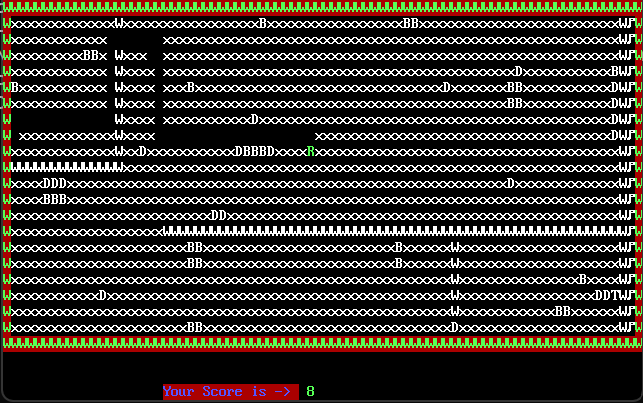

# Boulder Dash Game in Assembly Language

I developed this game as part of my project for the course Computer Organization and Assembly Language. It's a simplified assembly language adaptation of the classic DOS game "Boulder Dash" The objective is to navigate the character 'Rockford' through underground 'caves' to reach the exit while collecting diamonds and avoiding boulders.

## Gameplay Overview

In this simplified version, I designed Rockford to explore caves filled with 'dirt,' 'boulders,' and 'diamonds.' The primary objectives are as follows:

- Guide Rockford to the exit door while avoiding boulders.
- Collect diamonds to earn points before reaching the exit.
- Navigate through dirt and dig as needed to progress.

## Rules and Considerations

- **Movement:** Use arrow keys to control Rockford's movement.
- **Boulders:** Be cautious of boulders; walking beneath them leads to immediate death.
- **Diamonds:** Collect scattered diamonds to increase your score.
- **Boulders' Behavior:** Unlike the original game, boulders immediately crush Rockford if moved beneath.
- **Boulders' Stacking:** Unlike the original, boulders can be stacked on top of each other.

## Game Elements

- **'W':** Walls
- **'B':** Boulders
- **'D':** Diamonds
- **'R':** Rockford
- **'T':** Exit point

## File Handling

File handling is a crucial aspect of this project. The program reads cave layouts from text files (e.g., `cave.txt`) and processes the game's environment based on the data provided. This functionality enables dynamic and varied gameplay experiences by utilizing different cave layouts. You can customize the map layout by modifying the contents of the file `cave.txt`.

## Installation and Usage

1. **Install NASM:**
   I ensured that NASM (Netwide Assembler) is installed on your system. You can download and install it from the link: [NASM download link](https://www.x64bitdownload.com/download/t-64-bit-nasm-download-vbepnjoq.html)

2. **Install DOSBox:**
   DOSBox is an x86 emulator with DOS. I recommend downloading DOSBox from the official website: [DOSBox Official Website](https://sourceforge.net/projects/dosbox/files/latest/download)

3. **Compile and Run:**
   - Open DOSBox and navigate to the directory where your project files are located.
   - Use NASM to assemble the project's source code.
   - Run the resulting executable file to launch the game.

4. **Game Controls:**
   - Use arrow keys to move Rockford.
   - Press the Esc key to exit the game.

5. Press the `Esc` key to exit the game.

## Customization

Feel free to customize the visual elements of the game, such as colors and appearances, to enhance the user experience.

## License

This project is licensed under the [MIT License](LICENSE).
